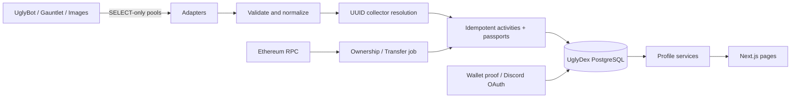

# Architecture

## Phase 1 read models and refresh worker

The modular monolith is retained. `server/collections.ts` queries only UglyDex-owned records and returns serializable card/summary projections. Explorer and collection pages use 24-item server pagination, stable token tie breakers, indexed points/rank, normalized trait predicates and database aggregates. Current membership is an EXISTS predicate over current ownership and all active proved Ethereum wallets; duplicated observations cannot duplicate cards. Unknown point totals remain unavailable. Slugs are presentation keys; UUIDs still own history.

`server/profiles.ts` uses an explicit public identity DTO. Private profiles have no public result. Wallet and authenticated Discord names require separate opt-ins. The Squig owner projection checks profile visibility and wallet visibility; Phase 2 exposes canonical public chain addresses separately from consented collector attribution; raw evidence metadata never leaves this service. Client components receive cards and allowlisted fields, never Prisma Collector/session/reconciliation objects.

The web refresh endpoint only queues work in `OwnershipRefresh`. A separate process runs `worker:ownership`, claims a fenced lease, pins a finalized block, reads at most 100 owners and commits observations/discoveries plus its next-token checkpoint atomically. A crash repeats at most one batch. An RPC failure preserves the checkpoint for a manual retry. The Transfer worker repairs bounded finalized hash mismatches and resets affected snapshots; deeper mismatches stop for operator review. Requests share one contract scan and a ten-minute per-collector limit in `CollectorRefreshRequest`. `sync:ownership` invokes the same worker until completion; `worker:ownership -- --once` runs one batch.

Readiness remains independent of legacy services. The admin bearer API includes owned-database counts, scan status/block, Transfer cursor and stale ownership counts. No external database is migrated or written.

UglyDex is a Next.js App Router modular monolith. Server-rendered pages read the UglyDex projection database through services. CLI import jobs read isolated external PostgreSQL adapters and write only the UglyDex Prisma database. Existing applications retain authority over games, rewards, submissions and wallet-link evidence. Ethereum retains authority over current NFT ownership.

## Boundaries

`src/integrations` owns external SELECT queries, validation, safe errors and source-specific mapping. It never exports a writable external client. Every query runs in a read-only transaction with deadlines; dedicated SELECT grants remain mandatory. No external module's initialization/migration code is reused.

`src/domain` owns address/token validation, reconciliation decisions and normalized event identity. `src/server` owns the writable database, auth and read models. `src/sync` owns batch/replay orchestration. `scripts` contains diagnostics, data export and sync entry points. Phase 1 runs the ownership worker from these modules in a separate Railway service.

## Provenance and idempotency

An activity identity includes source system, source type, durable row ID, event type and stable subject key (Discord ID or wallet, never mutable collector UUID). Guild is included where source keys are guild-scoped. Payload hash distinguishes inserted / updated / skipped. Collector association can be corrected without changing the event identity. Each participant in a duel gets a separate event. A unique passport event uses the activity key and asset identity. Activity, passport and import effects commit atomically.

Replay from the beginning uses bounded keyset pagination, including composite keys for Survival/links. This intentionally sees late completions/refunds/moderation changes; a created-ID-only persistent watermark would miss them. A SyncRun records sanitized counts and status; failed rows retry on the next replay. No routine truncation. Progression tables are placeholders for a future versioned, rebuildable rules engine, not an invented XP economy.

Ownership observations record block and source provenance separately from wallet identity. Transfer indexing is a CLI/background task with finalized block ranges, durable cursor and hash checks. No history scan occurs in a web request. Historical event attribution requires time-bounded wallet evidence; a wallet signed today cannot claim its entire previous lifetime.

## Availability and privacy

External results distinguish unconfigured, unavailable, schema mismatch, invalid data and empty success. An external outage does not fail app health. Local DB health determines readiness. Production requires the writable DB and a configured canonical HTTPS public URL; no runtime defaults to an external DB. Public profiles never render raw imported JSON, private wallet evidence, OAuth/session tokens or moderation notes. Admin diagnostics are development-only in Phase 0; the authenticated production API requires a configured bearer secret.

## Phase 0 limits

No production backfill is run without credentials. Initial normalized imports cover Duels, both marketplaces, bounty submissions, Maw feeds, claims, Gauntlet runs, Survival participant observations and image approvals; the inventory identifies additional adapters to add. Mutable observations retain their source semantics, not invented exact completion timestamps. Auth merges and historical wallet adjudication remain explicit review workflows. No reward payout, balances, XP awards or write-back to ecosystem services.

## Phase 2 provenance flow

Finalized Ethereum logs → `NftTransfer` + cached `ChainBlock` + atomic `ChainCursor` checkpoint → durable dirty `SquigProvenance` → wallet periods → dated identity intersection → collector periods/discoveries/ownership timeline → explicit public DTOs. Existing `SquigOwnership` remains the current collection read model; newer pinned ownerOf observations can coexist with a still-backfilling ledger.

The worker alternates Transfer chunks and ownership refresh work. Per-chain session advisory locks prevent overlapping scans; per-token transactions prevent partial projections. Admin decisions retain immutable audit records and queue rebuilds without changing raw facts or external databases. Web requests never perform full-chain scans. See [provenance](provenance.md) for finalization, bounded reorg recovery, evidence intervals, verification and repair, and [Railway](railway.md) for deployment.

## Phase 3 activity layer

Read-only source adapter → explicit source mapping → dated identity resolution → atomic source-record/slot reconciliation → existing CollectorActivity + SquigPassportEvent → indexed timeline/statistics/gallery projections. IntegrationSource records coverage and cursors; SyncRun records attempts and counts; ActivityCorrection retains previous values; ImportRejection isolates bad rows; ActivityAttributionJob makes later review-driven reassignment durable. No parallel economy ledger was introduced. See [activity model](activity-model.md) for mappings, currency evidence, cursor precision and correction semantics.

Public projections omit operational fields and require consented identity visibility. Blockchain Passport and ecosystem history are separately paginated sections on the same Squig page; both use the reusable Timeline presentation. Legacy normalized facts retain source authority. The new ecosystem Railway worker runs separately from the existing blockchain worker and shares only UglyDex-owned state.
